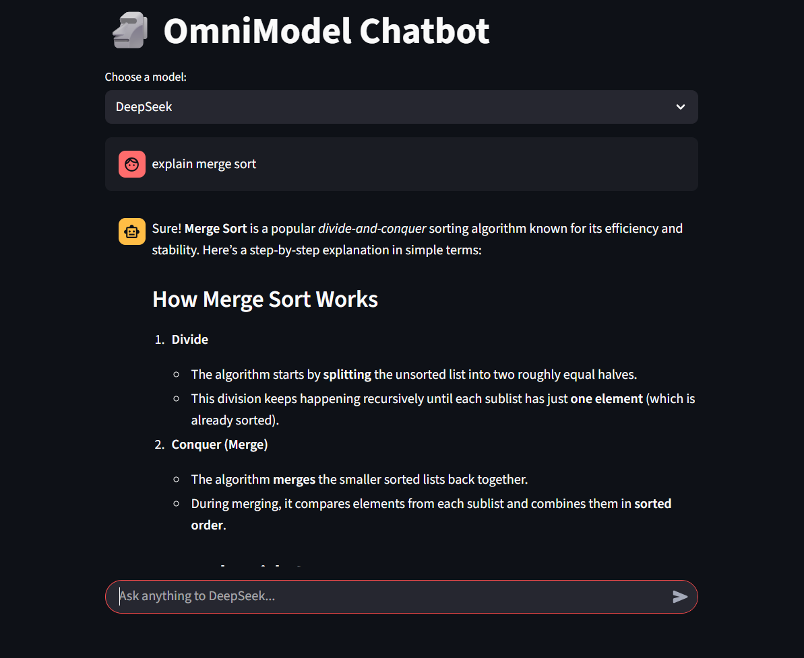

## 📚 About the Project

**OmniModel Chatbot** is an advanced, user-friendly AI chatbot platform built with Streamlit and powered by OpenRouter. Unlike traditional chatbots that use only one language model, OmniModel Chatbot allows users to seamlessly switch between multiple cutting-edge large language models (LLMs) within a single conversation.

This project showcases the unique strengths and personalities of different AI models—including OpenAI GPT-4o, Anthropic Claude, Meta Llama, DeepSeek, Google Gemini, and more—through a unified, interactive interface. The app maintains persistent chat history, supports real-time model switching, and features robust error handling for quota or API issues.

### ✨ Key Highlights

- **Multi-model Selection:** Instantly switch between top open-source and commercial AI models.
- **Unified Chat Interface:** Chat with any model, with your conversation history always preserved—even when you change models.
- **Educational and Experimental:** Perfect for comparing models, learning programming, or exploring how AI answers differ by provider.
- **Accessible and Flexible:** Free models are available, and you can extend the system by adding more models from OpenRouter.
- **Robust Error Handling:** Clearly explains quota errors, unsupported requests, or API issues for a smooth user experience.

### 💡 Typical Use Cases

- Benchmarking LLMs for different tasks (coding, explanation, summarization, etc.)
- Tutoring, code help, and learning support for students and educators
- Experimenting with different AI personalities and reasoning styles

---

### 🖼️ Screenshot

---

**Developed by:**  
_Ishatva Singh Panwar_
